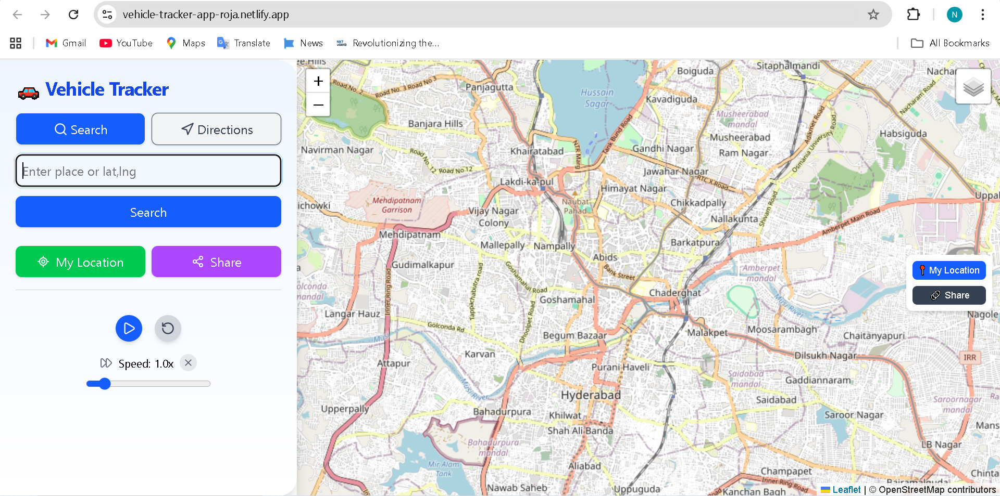
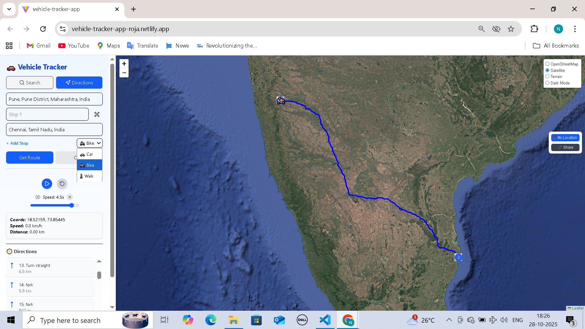

# 🚗 Vehicle Tracker App

An interactive **vehicle tracking and navigation web application** built with **React, Leaflet, and OSRM**, allowing users to search places, get driving/biking/walking routes, visualize playback animation along the route, and monitor live telemetry (speed, distance, and coordinates).

---

## 📸 Preview

<p align="center">
  
  <br/>
  
</p>

---

🌐 **Live Demo:**  
🔗 [https://vehicle-tracker-app-roja.netlify.app/](https://vehicle-tracker-app-roja.netlify.app/)

📦 **Repository:**  
🔗 [https://github.com/rojanagunoori/vehicle-tracker-app](https://github.com/rojanagunoori/vehicle-tracker-app)

---

## ✨ Features

### 🗺️ Map & Location
- Interactive map powered by **Leaflet**.
- Locate yourself instantly using **browser geolocation**.
- Switch between **OpenStreetMap**, Satellite, Terrain, and Dark mode layers.
- Share map position easily via a generated link.

### 🔍 Search Mode
- Search any place using **OpenStreetMap’s Nominatim API**.
- Autocomplete suggestions as you type.
- Displays precise latitude and longitude.
- “My Location” button for quick centering.

### 🚘 Route Navigation
- Generate routes using **OSRM (Open Source Routing Machine)**.
- Supports **Car**, **Bike**, and **Walk** modes.
- Multi-stop route planning (From → Stops → To).
- Step-by-step turn instructions with icons:
  - ⬆️ Continue Straight  
  - ↩️ Turn Left / Right  
  - 🔄 Roundabout  
  - 🏁 Destination  
- Travel modes are extensible for future expansions (e.g., Transit).
- Custom SVG icon set via `RoutingSprite.jsx`.

### 📍 Live Map Visualization
- Displays markers for waypoints and destination.
- Draws route geometry using **GeoJSON** from the OSRM Routing API.
- Vehicle marker animates smoothly along the route in real time.

### ▶️ Playback Simulation
- Animate vehicle movement along the path.
- **Play / Pause / Reset** controls.
- Adjustable playback **speed (0.5× – 5×)**.
- Real-time telemetry includes:
  - Current coordinates  
  - Speed (km/h)  
  - Distance covered (km)  
- Updates continuously during simulation.

### 🛰️ Telemetry Panel
- Displays simulated coordinates, speed, and total distance.
- Live updates synchronized with playback state.

### 🔗 Sharing
- Share your current route or location with one click.
- Supports native mobile sharing or clipboard copy.

### 📱 Responsive & Modern UI
- Sidebar toggles automatically on mobile devices.
- Smooth, fluid animations powered by **Framer Motion**.
- Clean, minimal design styled with **Tailwind CSS**.
- Collapsible sections for an optimized mobile experience.

---

## 🧰 Tech Stack

| Category | Technologies |
|-----------|---------------|
| **Frontend Framework** | React (Vite) |
| **Mapping & Routing** | Leaflet, React-Leaflet, OSRM API |
| **UI / Styling** | Tailwind CSS, Framer Motion, Lucide Icons |
| **State Management** | React Hooks + Context API |
| **Deployment** | Netlify |

---

## 🚀 Getting Started

### 1️⃣ Clone the repository
```bash
git clone https://github.com/rojanagunoori/vehicle-tracker-app.git
cd vehicle-tracker-app
```
### 2️⃣ Install dependencies
```bash
npm install
```
### 3️⃣ Run locally
```bash
npm run dev
```
Visit 👉 http://localhost:5173

## ⚙️ Project Structure
```bash
src/
│
├── components/
│   ├── Sidebar.jsx           # Main control panel for search, routing, and playback
│   ├── MapView.jsx           # Leaflet map + route drawing + playback animation
│   ├── PlaybackControls.jsx  # Play/Pause/Reset/Speed controls
│   ├── RoutingSprite.jsx     # SVG icons for navigation directions
│
├── playback/
│   └── PlaybackProvider.jsx  # Global playback context provider
│
├── App.jsx                   # Root component - combines map and sidebar
├── index.css                 # Tailwind and global styles
└── main.jsx                  # React entry point (Vite)
```


## 🌍 APIs Used
| API                                    | Description                                      |
| -------------------------------------- | ------------------------------------------------ |
| **Nominatim (OpenStreetMap)**          | For geocoding (searching places)                 |
| **OSRM (Open Source Routing Machine)** | For route generation and turn-by-turn directions |

## 🧩 Key Components
#### 1. Sidebar

Handles search, directions, travel mode, and route steps.

Provides playback controls and telemetry.

#### 2. MapView

Displays route and markers.

Animates vehicle movement with real-time telemetry updates.

#### 3. PlaybackProvider

Global context for managing playback state (isPlaying, speed, resetSignal).

## 🧠 How Playback Works

1. When a route is generated, MapView stores route coordinates.

2. The user clicks Play → animation starts using requestAnimationFrame().

3. The vehicle marker moves smoothly along route coordinates.

4. telemetry is continuously updated (distance, elapsed time, speed).

5. Reset restores marker to start position instantly.

### 🖼️ Screenshots
| Feature                     | Preview                                    |
| --------------------------- | ------------------------------------------ |
| **Map with Route**          | 🗺️ Displays route path between points     |
| **Turn-by-turn Directions** | 🧭 Step-by-step navigation with icons      |
| **Playback Controls**       | ▶️ Adjustable speed, play/pause/reset      |
| **Telemetry**               | 📊 Real-time data: coords, speed, distance |

(Add screenshots here if you have them in /public or hosted online)

## ⚡ Deployment

This app is deployed on Netlify:

Build Settings:
```bash
Build Command: npm run build
Publish Directory: dist
```

To deploy manually:

```bash
npm run build
netlify deploy
```

## 🧑‍💻 Author

### 👩‍💻 Roja Nagunoori
Frontend Developer | GIS & Mapping Enthusiast

🌐 **Live Demo:** [vehicle-tracker-app-roja.netlify.app](https://vehicle-tracker-app-roja.netlify.app)  
💻 **GitHub:** [@rojanagunoori](https://github.com/rojanagunoori)

## 📜 License

This project is open-source under the MIT License.
Feel free to use and modify it for learning or personal projects.

## ❤️ Acknowledgements

- [OpenStreetMap](https://www.openstreetmap.org/)
- [OSRM Routing Engine](http://project-osrm.org/)
- [Leaflet](https://leafletjs.com/)
- [React Leaflet](https://react-leaflet.js.org/)
- [Lucide React Icons](https://lucide.dev/)
- [Framer Motion](https://www.framer.com/motion/)

### ⭐ If you like this project, please consider giving it a star on GitHub!


---

Would you like me to include **preview screenshots placeholders** (for your Netlify app UI) and auto-generate image tags for them too (so it looks great on GitHub)?
