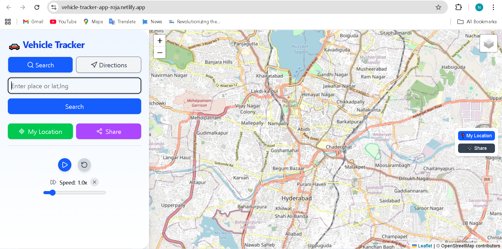
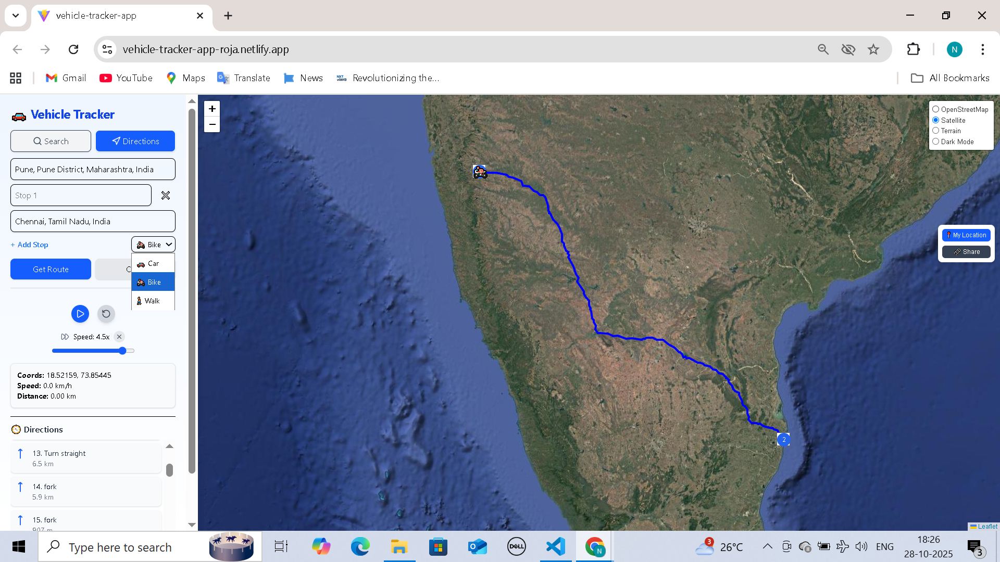
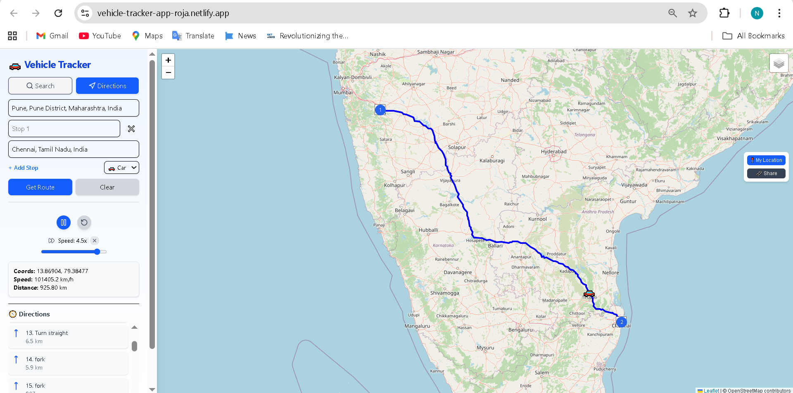
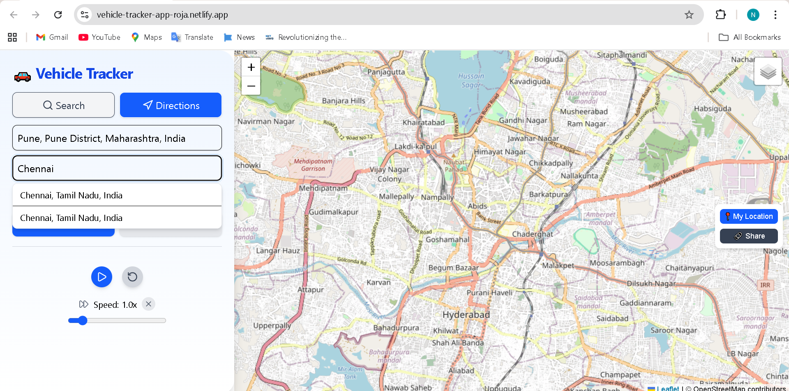

# 🚗 Vehicle Tracker App

An interactive **vehicle tracking and navigation web application** built with **React, Leaflet, and OSRM**, allowing users to search places, get driving/biking/walking routes, visualize playback animation along the route, and monitor live telemetry (speed, distance, and coordinates).

---

## 📸 Preview

<p align="center">
  
  <br/>
  
  
    
</p>

---

🌐 **Live Demo:**  
🔗 [https://vehicle-tracker-app-roja.netlify.app/](https://vehicle-tracker-app-roja.netlify.app/)

📦 **Repository:**  
🔗 [https://github.com/rojanagunoori/vehicle-tracker-app](https://github.com/rojanagunoori/vehicle-tracker-app)

---

## 1. Project Overview

Vehicle Tracker App is a web application for mapping, routing, and simulating vehicle travel. Users can:

- Search for locations using OpenStreetMap.
- Plan multi-stop routes.
- Switch travel modes: Car, Bike, or Walk.
- Animate vehicle movement along the planned route.
- Monitor real-time telemetry (coordinates, speed, distance).

This project exists to provide a lightweight, open-source tool for route planning and GPS simulation, useful for learning, testing, and demonstration purposes.

---

2. ## ✨ Features

### 🗺️ Map & Location

- Interactive map powered by **Leaflet**.
- Locate yourself instantly using **browser geolocation**.
- Switch between **OpenStreetMap**, Satellite, Terrain, and Dark mode layers.
- Share map position easily via a generated link.

### 🔍 Search Mode

- Search any place using **OpenStreetMap’s Nominatim API**.
- Autocomplete suggestions as you type.
- Displays precise latitude and longitude.
- “My Location” button for quick centering.

### 🚘 Route Navigation

- Generate routes using **OSRM (Open Source Routing Machine)**.
- Supports **Car**, **Bike**, and **Walk** modes.
- Multi-stop route planning (From → Stops → To).
- Step-by-step turn instructions with icons:
  - ⬆️ Continue Straight
  - ↩️ Turn Left / Right
  - 🔄 Roundabout
  - 🏁 Destination
- Travel modes are extensible for future expansions (e.g., Transit).
- Custom SVG icon set via `RoutingSprite.jsx`.

### 📍 Live Map Visualization

- Displays markers for waypoints and destination.
- Draws route geometry using **GeoJSON** from the OSRM Routing API.
- Vehicle marker animates smoothly along the route in real time.

### ▶️ Playback Simulation

- Animate vehicle movement along the path.
- **Play / Pause / Reset** controls.
- Adjustable playback **speed (0.5× – 5×)**.
- Real-time telemetry includes:
  - Current coordinates
  - Speed (km/h)
  - Distance covered (km)
- Updates continuously during simulation.

### 🛰️ Telemetry Panel

- Displays simulated coordinates, speed, and total distance.
- Live updates synchronized with playback state.

### 🔗 Sharing

- Share your current route or location with one click.
- Supports native mobile sharing or clipboard copy.

### 📱 Responsive & Modern UI

- Sidebar toggles automatically on mobile devices.
- Smooth, fluid animations powered by **Framer Motion**.
- Clean, minimal design styled with **Tailwind CSS**.
- Collapsible sections for an optimized mobile experience.

---

## 3. Folder / Project Structure

```bash
src/
├── components/
│   ├── Sidebar.jsx          # Search & directions panel
│   ├── MapView.jsx          # Map rendering & playback animation
│   ├── PlaybackControls.jsx # Play/Pause/Reset controls
│   └── RoutingSprite.jsx    # Navigation step icons
├── playback/
│   └── PlaybackProvider.jsx # Context for playback state
├── App.jsx                  # Main App component
├── main.jsx                 # React DOM entry
└── index.css                # Global styles

```

## 4. 🧰 Tech Stack

<!-- | Category | Technologies |
|-----------|---------------|
| **Frontend Framework** | React (Vite) |
| **Mapping & Routing** | Leaflet, React-Leaflet, OSRM API |
| **UI / Styling** | Tailwind CSS, Framer Motion, Lucide Icons |
| **State Management** | React Hooks + Context API |
| **Deployment** | Netlify | -->

| Category      | Technologies                              |               |
| ------------- | ----------------------------------------- | ------------- |
| Frontend      | React (Vite)                              |               |
| Mapping       | Leaflet, react‑leaflet                    |               |
| Routing API   | OSRM                                      |               |
| UI Components | Tailwind CSS, Lucide Icons, Framer Motion |               |
| Deployment    | Netlify                                   |               |
| Geocoding     | OpenStreetMap Nominatim                   | ([GitHub][1]) |

[1]: https://github.com/rojanagunoori/vehicle-tracker-app "GitHub - rojanagunoori/vehicle-tracker-app · GitHub"

---

## 5. Installation / Setup

### 1️⃣ Clone the repository

```bash
git clone https://github.com/rojanagunoori/vehicle-tracker-app.git
cd vehicle-tracker-app
```

### 2️⃣ Install dependencies

```bash
npm install
```

### 3️⃣ Run locally

```bash
npm run dev
```

Open your browser and go to http://localhost:5173 to view the app.

## 6. 🌍 APIs Used

| API                                    | Description                                      |
| -------------------------------------- | ------------------------------------------------ |
| **Nominatim (OpenStreetMap)**          | For geocoding (searching places)                 |
| **OSRM (Open Source Routing Machine)** | For route generation and turn-by-turn directions |

### Geocoding a location:

```bash
const geocodeSingle = async (q) => {
  const res = await fetch(`https://nominatim.openstreetmap.org/search?format=json&q=${q}&limit=1`);
  const data = await res.json();
  return data.length ? { lat: parseFloat(data[0].lat), lon: parseFloat(data[0].lon) } : null;
};
```

### Routing with OSRM:

```bash
const coords = points.map(p => `${p.lon},${p.lat}`).join(';');
const res = await fetch(`https://router.project-osrm.org/route/v1/driving/${coords}?overview=full&geometries=geojson`);
const route = await res.json();
```

---

## 7. 🧩 Key Components

#### 1. Sidebar

Handles search, directions, travel mode, and route steps.

Provides playback controls and telemetry.

#### 2. MapView

Displays route and markers.

Animates vehicle movement with real-time telemetry updates.

#### 3. PlaybackProvider

Global context for managing playback state (isPlaying, speed, resetSignal).

---

## 8. Security

- No authentication required (public demo).
- Uses browser geolocation API securely.
- OSRM and Nominatim APIs are public and read-only.

---

## 9. Challenges Faced During Development

- **1. Route Geocoding (Multi-stop Handling)**

Handling routes with multiple stops (From → Stops → To) was not straightforward because:

- The Nominatim API only supports single-location queries.
- Each stop had to be geocoded sequentially, not in parallel, to preserve route order.
- If any one location failed, the entire routing process could break.

**Solution:**

- Implemented a loop to geocode each point one-by-one.
- Added validation to stop execution if any location is not found.
- Ensured correct formatting (lon,lat) for OSRM API requests.

```bash
for (let p of points) {
  const g = await geocodeSingle(p.value);
  if (!g) {
    alert(`Could not find ${p.value}`);
    return;
  }
  geocoded.push(g);
}
```

- **2. Playback Simulation (Smooth Vehicle Animation)**

Animating a vehicle along a route was challenging because:

- Route data comes as discrete coordinates, not continuous motion.
- Directly jumping between points caused jerky animation.
- Speed needed to be realistic but also adjustable for simulation.

**Solution:**

- Precomputed cumulative distances between coordinates.
- Used `requestAnimationFrame` for smooth frame updates.
- Interpolated positions between points for continuous movement.
- Introduced a simulation scaling factor to control playback duration.

```bash
const progress = elapsed / total;
const pos = sampleAt(progress);
setVehiclePos(pos);
```

- **3. Autocomplete Suggestions (Multiple Inputs)**

- Managing suggestions for multiple input fields (From, Stops, To) was tricky:

- All inputs initially shared the same suggestions state.
- Typing in one field affected dropdowns in others.
- UI conflicts occurred when switching between inputs quickly.

**Solution:**

- Introduced `activeField` state to track the focused input.
- Rendered suggestions only for the active field.
- Cleared suggestions after selection to avoid overlap.

```bash
onFocus={() => setActiveField(i)}
```

- **4. Synchronizing Playback with Telemetry**

Ensuring telemetry updates matched the animation:

- Needed real-time updates for:
  - Coordinates
  - Speed
  - Distance
- Avoided unnecessary re-renders while keeping data accurate.

**Solution:**

- Used a centralized PlaybackContext for global state.
  Passed onPlaybackUpdate callback from MapView to update telemetry.
  Ensured updates only occur during active playback.
- **5. Reset & Playback Control**

- Resetting playback introduced edge cases:

- Animation frame (requestAnimationFrame) needed proper cleanup.
- Marker position had to instantly return to the starting point.
- Playback state needed synchronization across components.

**Solution:**

- Introduced a resetSignal in context.
- Cancelled animation frames safely.
- Forced position reset using useEffect.

---

## 10. Future Improvements

### 🚀 1. User Authentication & Saved Routes

Allow users to:

- Save favorite routes
- View history
- Resume previous sessions
- Could be implemented using:
- Firebase Auth / JWT
- Backend (Node.js + MongoDB)

### 🚦 12. Real-Time Traffic Integration

- Current routes are static (no traffic - awareness).
- Integrate APIs like Google Maps Traffic or Mapbox Traffic
- Display congestion using colored route segments
- Future improvement:
- Adjust ETA dynamically

### 🗺️ 3. Advanced Map Styling (Mapbox Integration)

- Current maps are limited to OSM tile layers.
- Add:
  - Custom Mapbox styles
  - 3D terrain
  - Better satellite imagery
- Improves UI/UX significantly for production-grade apps.

  ### 📡 4. Offline Routing Support
  - Currently requires internet for:
  - Geocoding
  - Routing
  - Future enhancement:
    - Cache route GeoJSON locally
    - Use preloaded map tiles
    - Enable offline navigation simulation
    - Current maps are limited to OSM tile layers.

### 📊 5. Advanced Analytics & Telemetry

- Add:
  - Trip duration tracking
  - Speed graphs
  - Distance vs time charts
- Could use chart libraries like Recharts or Chart.js

### 📱 6. Mobile App Version

- Convert to mobile app using:
  - React Native or Expo
- Add GPS tracking + real-time movement

### 🤖 7. Smart Routing Enhancements

- Add:
  - Alternative routes comparison
  - Shortest vs fastest route toggle
  - Waypoint optimization (like delivery apps)

### 🎯 8. UI/UX Enhancements

- Better dropdown handling (debounced search)
- Voice input for location search
- Drag-and-drop route editing on map

---

## 11. 🧠 How Playback Works

1. When a route is generated, MapView stores route coordinates.

2. The user clicks Play → animation starts using requestAnimationFrame().

3. The vehicle marker moves smoothly along route coordinates.

4. telemetry is continuously updated (distance, elapsed time, speed).

5. Reset restores marker to start position instantly.

### 🖼️ Screenshots

| Feature                     | Preview                                    |
| --------------------------- | ------------------------------------------ |
| **Map with Route**          | 🗺️ Displays route path between points      |
| **Turn-by-turn Directions** | 🧭 Step-by-step navigation with icons      |
| **Playback Controls**       | ▶️ Adjustable speed, play/pause/reset      |
| **Telemetry**               | 📊 Real-time data: coords, speed, distance |

(Add screenshots here if you have them in /public or hosted online)

## 12. ⚡ Deployment

This app is deployed on Netlify:

Build Settings:

```bash
Build Command: npm run build
Publish Directory: dist
```

To deploy manually:

```bash
npm run build
netlify deploy
```

---

## 13. Contributing

1. Fork the repo.
2. Create a new branch (`git checkout -b feature-name`).
3. Make changes and commit (`git commit -m "Add feature"`).
4. Push to branch (`git push origin feature-name`).
5. Open a pull request.

---

## 14. ❤️ Acknowledgements

- [OpenStreetMap](https://www.openstreetmap.org/)
- [OSRM Routing Engine](http://project-osrm.org/)
- [Leaflet](https://leafletjs.com/)
- [React Leaflet](https://react-leaflet.js.org/)
- [Lucide React Icons](https://lucide.dev/)
- [Framer Motion](https://www.framer.com/motion/)

---

## 15. 📜 License

This project is open-source under the MIT License.
Feel free to use and modify it for learning or personal projects.

---

## 16. 🧑‍💻 Author

### 👩‍💻 Roja Nagunoori

Frontend Developer | GIS & Mapping Enthusiast

🌐 **Live Demo:** [vehicle-tracker-app-roja.netlify.app](https://vehicle-tracker-app-roja.netlify.app)

- 📧 Email: [nagunooriroja@gmail.com](mailto:nagunooriroja@gmail.com)
- 🌐 GitHub: [https://github.com/rojanagunoori](https://github.com/rojanagunoori)
- 🌐 LinkedIn: [https://www.linkedin.com/in/nagunoori-roja-51b936267/](https://www.linkedin.com/in/nagunoori-roja-51b936267/)
- 🌐 Personal Portfolio: [portfolio-roja.netlify.app](https://portfolio-roja.netlify.app/)
- 🌐 LeetCode: [https://leetcode.com/u/dSdsi6XkI8/](https://leetcode.com/u/dSdsi6XkI8/)
- 🌐 Kaggle: [https://www.kaggle.com/nagunooriroja](https://www.kaggle.com/nagunooriroja)

### ⭐ If you like this project, please consider giving it a star on GitHub!

---

Would you like me to include **preview screenshots placeholders** (for your Netlify app UI) and auto-generate image tags for them too (so it looks great on GitHub)?
